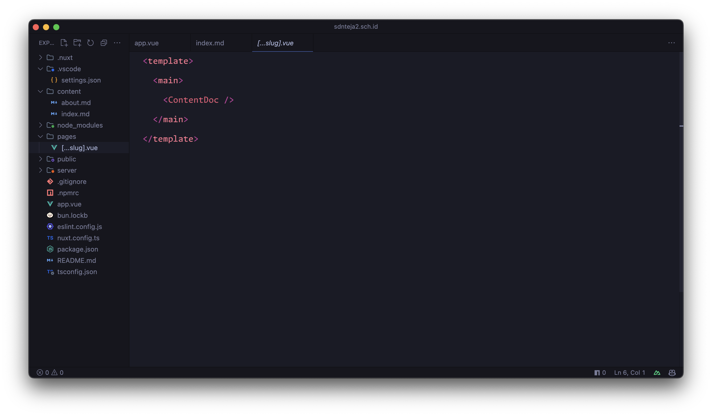
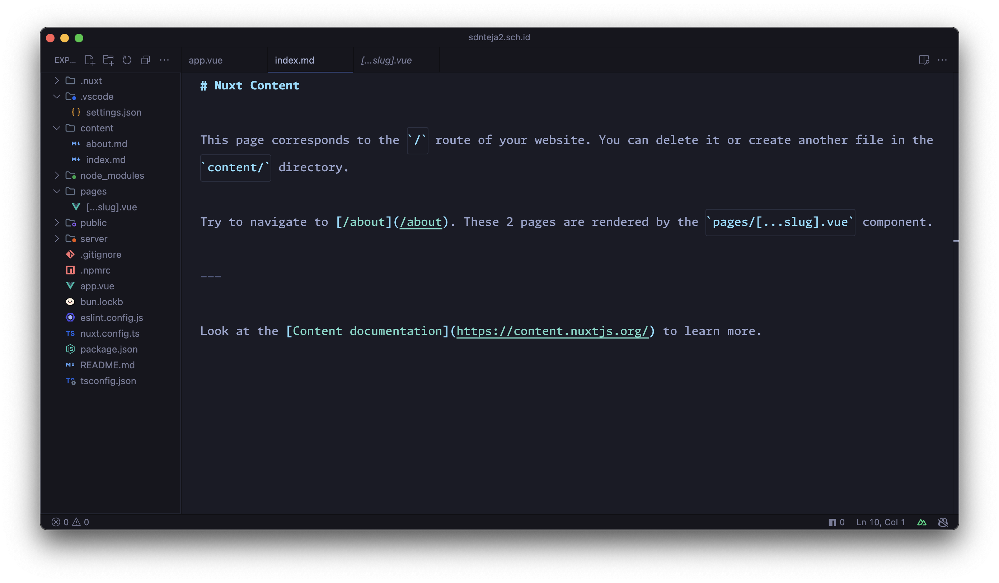

# VS Code Minimalist Setting

- [VS Code Minimalist Setting](#vs-code-minimalist-setting)
  - [How to use (Vs Code Setting )](#how-to-use-vs-code-setting-)
  - [How to use (Profile Import)](#how-to-use-profile-import)
  - [Supported Extension](#supported-extension)
    - [✅ - Nuxt.js \& Vue.js](#---nuxtjs--vuejs)
  - [Screenshots](#screenshots)

This is my minimalist setting for VS Code.
You can use it for your own setting.
For now, it only contains the setting for Nuxt.js.

## How to use (Vs Code Setting )

1. Open your VS Code setting (JSON).
2. Copy the content of `settings.json` and paste it to your VS Code setting (JSON).

## How to use (Profile Import)

1. Open your VS Code.
2. Import the `vuejs-setting.code-profile` file to your VS Code.

## Supported Extension

### ✅ - Nuxt.js & Vue.js

- [Vue Language Features (Volar)](https://marketplace.visualstudio.com/items?itemName=Vue.volar)

- ✅ - HTML
- ✅ - CSS
- ✅  -
- ❌ - React.js
- ❌ - Angular.js
- ❌ - Node.js
- ❌ - Python
- ❌ - PHP
- ❌ - C#
- ❌ - C++
- ❌ - C
- ❌ - Java
- ❌ - Kotlin
- ❌ - Ruby
- ❌ - Go
- ❌ - Rust
- ❌ - Swift
- ❌ - Dart
- ❌ - Flutter
- ❌ - TypeScript

## Screenshots

